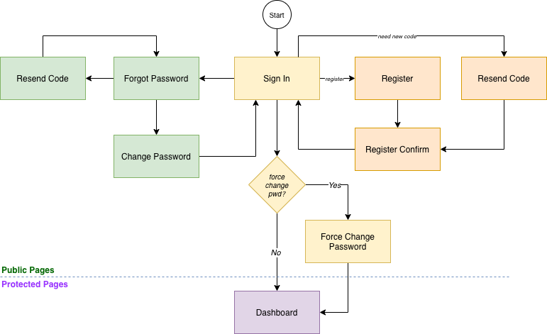
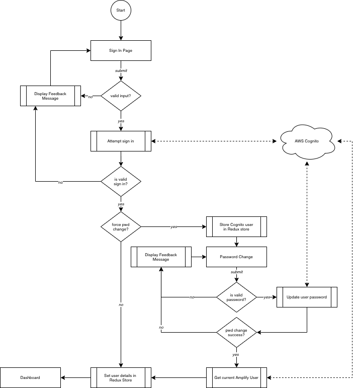
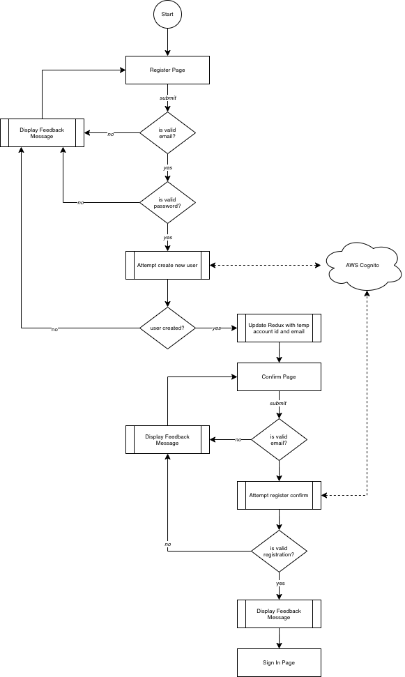
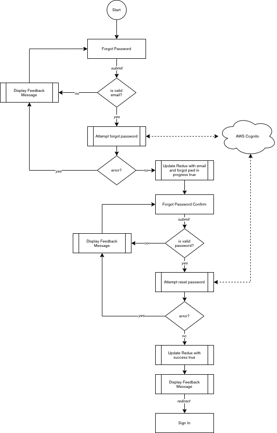

# React + AWS Cognito Starter Template

A sample react application (template) that integrates AWS Cognito for user authentication.

## Public vs Protected Views

There are many different ways to handle showing/hiding components based on the user authentication state and having banged my head against a wall for a while I landed on a simple mechanism of having a two completely separate application components: public (auth) and protected with a main app controlling which one to display.

Separating the two components simplifies any check login status methods needed and defers to the parent App component. Within the main App component, on first render it checks to see if the user is currently signed in and sets up the auth state accordingly. If the user is signed in it will render a version of the AppContainer component with the protected routes. If the user is not signed in it will render a version of the AppContainer with the public (auth) routes.

> The inspiration for this was taken from [Kent C. Dodds](https://kentcdodds.com/blog/authentication-in-react-applications) which I found to be the simplest and most succinct way to handle access to protected resources in React Applications.

### Route Configuration

I like to define routes and paths in separate files so they can be easily accessed in other components for actions like redirects. Doing this also allows me to use a common AppContainer component to handle the rendering of the various components simply by passing in routes and paths as props.

## Cognito User Pool

The AWS Amplify framework handles all the heavy lifting when it comes to authentication; we just make calls to the various functions. The only thing you need to create is a Cognito UserPool and I've included a simple CloudFormation template in the `_aws` folder.

To keep things simple, this example uses email for the username. It also requires a name to be provided and enforces typical complex password requirements.

Once you've created the user pool you'll need to update the settings in file `/src/aws-config.js`.

## Redux

I employ Redux for the centralized management of state. If you have another state management framework you should be able to swap it out easily. Types, Action and Reducers are kept together in one file specific to the "module" it's relevant to. In this application you'll find these files here:

- `/src/app/appStore.js`
- `/src/auth/authStore.js`

## Authentication Overview

The diagram below provides a simple overview of the authentication components:

> Keep in mind when using Cognito for authentication that all roads lead back to the sign in page. What I mean by that is when a user registers for a new account or goes through the forgot password flow, once confirmed the user will need to sign in again. I've seen folks discussing this and feel it can be annoying; the user just keyed in a new password shouldn't they be automatically signed in?! Also saw folks getting creative and caching passwords to then use then for an automatic sign in but this is not a good approach; esp when using a client side framework like React. This project uses Cognito in the way it's meant to be used and for the one time a user registers and the few times a user needs to reset a password it's a couple more clicks that I'm ok with.

### Sign In

The sign in logic looks something like this:

_NOTE: the force change password only happens for user accounts that are manually created in Cognito. This doesn't happen for users that register via the app._

### Register

The register logic looks something like this:

In this example I'm generating a new account ID for the user and attaching this to the Cognito account. This assumes once the user is finally logged in the application has access to the account id for the user and can setup the relevant data store records.

I'm choosing to defer the creation of an "account" until after the user has logged in for the first time (not actually implemented here). This is to avoid having orphan accounts kicking around if the user never actually logs in. It also ensures the user is validated before any application api calls are executed. It's assumed the REST API for the application is hosted on AWS and leverages API Gateway as the endpoint with Cognito authentication enabled.

### Forgot Password

The forgot password logic looks something like this:

## Live Example

You can see this in action by visiting the [live demo here](http://reactcognito.pjdsolutions.com)
